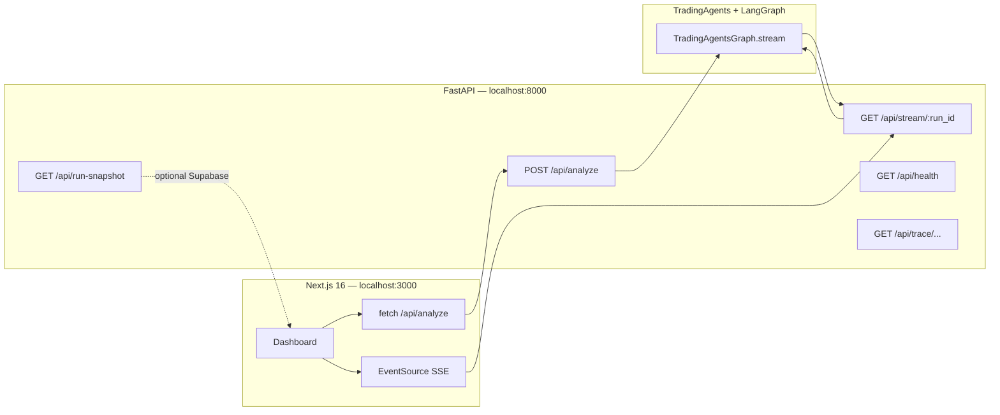

# Hindsight 20/20

**Retro-temporal market analysis engine** — a dark, dashboard-first UI for forensic-style multi-agent analysis on a **ticker** and **historical as-of date**. The backend wraps a LangGraph-powered **TradingAgents** pipeline, streams progress over **Server-Sent Events (SSE)**, optionally persists completed runs to **Supabase** for replay, and correlates runs with **Langfuse** traces when configured.

---

## What makes this repo interesting

### Point-in-time (“as of”) analysis

You choose a **trade date** and symbol; upstream agents pull data and narrative as if rewinding the clock. The UI ships **curated presets** (Pre-Lehman, Flash Crash, COVID bottom, FTX, GameStop, etc.) with sensible default tickers — useful for stress-testing the stack on well-known episodes.

### Agent pipeline, not a single chat box

Runs flow through specialist roles aligned with TradingAgents:

- **Market**, **Social**, **News**, and **Fundamentals** analysts produce structured reports.
- **Bull / Bear** researchers and the **Research Manager** run an **investment debate** phase.
- The **Trader** proposes a plan; **Aggressive / Conservative / Neutral** analysts and the **Risk Judge** run a **risk debate** phase.
- A **final trade decision** is emitted at the end of the graph stream.

The backend maps LangGraph stream chunks to stable agent names so the UI labels tools and statuses correctly (including tool sub-nodes).

### Live topology on the graph

On each run, the API emits a **`pipeline_topology`** event: nodes and edges extracted from the compiled LangGraph and **normalized** to the agents participating in that run — the React UI (@xyflow/react) renders the DAG you are actually executing.

### Transparent execution

SSE event types include:

| Event | Purpose |
|--------|---------|
| `pipeline_topology` | Graph structure for the run |
| `agent_status` | Pending / in progress / completed per agent |
| `graph_step` | Single-node graph updates when detectable |
| `tool_call` | Tool name, inputs/outputs (payload-capped), attributed to the active agent |
| `llm_usage` | Per-call and run-aggregated token usage; optional USD estimate when pricing env vars are set |
| `report` | Analyst reports and trader plan sections |
| `debate` | Investment- and risk-debate segments by speaker |
| `decision` | Parsed final decision + raw text |
| `stream_bootstrap` | Full UI snapshot when reconnecting with `GET /api/stream/{run_id}?resume=true` |
| `done` / `error` | Run completion (idle streams can also end with a timeout `error` + `done`) |

### Observability and replay

When Langfuse is configured, the backend generates **trace** and **session** IDs for correlation and exposes **`GET /api/trace/{trace_id}`** (structured span data for debugging) and **`GET /api/trace/{trace_id}/link`** (project URL when `LANGFUSE_PROJECT_ID` is set).

With **Supabase** configured (`SUPABASE_URL` + `SUPABASE_SERVICE_ROLE_KEY`), completed runs are upserted server-side; the UI can **`GET /api/run-snapshot?run_id=…`** or **`?trace_id=…`** to hydrate a finished analysis without re-running the graph.

### Configuration mirrors TradingAgents

`backend/config.py` builds a config dict from environment variables loaded from **`.env` at the repository root** (LLM provider, OpenRouter vs OpenAI, model names, rate limits, debate rounds, optional **data vendor** overrides). Use **`.env.example`** at the repo root as a template.

### Frontend ↔ API ergonomics

- **`POST /api/analyze`** is proxied through Next.js rewrites for same-origin `fetch`.
- **SSE** connects **directly** to the FastAPI origin (`http://localhost:8000` in dev when `NEXT_PUBLIC_BACKEND_URL` is unset) so the browser is not stuck behind a buffering proxy. For production builds (e.g. Vercel), set **`NEXT_PUBLIC_BACKEND_URL`** before `next build` and allow the UI origin in **`CORS_ALLOWED_ORIGINS`** on the API.

---

## Architecture



---

## Repository layout

| Path | Role |
|------|------|
| `pyproject.toml` | Package **`hindsight2020`** — engine (`tradingagents`, `cli`), FastAPI stack, and tooling (`requires-python >= 3.10`) |
| `.env` / `.env.example` | Secrets and config at **repo root** (backend, scripts, and CLI) |
| `tradingagents/` | Core LangGraph engine — **see [Tradingagents package](#tradingagents-package)** |
| `cli/` | Typer CLI (`tradingagents` console script) used by `main.py` and `scripts/backtest_mvp.py` |
| `scripts/` | `backtest_mvp.py` (historical backtests → `eval_results/…`), `kite_token_server.py` (Zerodha Kite OAuth helper) |
| `main.py` | Standalone runner for the graph (loads `.env` from repo root) |
| `ROADMAP.md` | Engine / product roadmap notes |
| `backend/` | FastAPI app (`server.py`), SSE bridge (`stream_handler.py`), topology + tool extraction, Langfuse helpers, optional Supabase persistence |
| `frontend/` | Next.js App Router UI — pipeline canvas, controls, reports, debates |
| `frontend/lib/presets.ts` | Historical date / ticker presets |

### Tradingagents package

The **`tradingagents/`** directory is the **TradingAgents-style engine** bundled with the `hindsight2020` install. The FastAPI layer (`backend/`) and CLI (`cli/`, `main.py`) both drive the same graph code.

| Area | Role |
|------|------|
| **`graph/`** | **`TradingAgentsGraph`** (`trading_graph.py`) — LangGraph wiring, tool nodes, **`Propagator`** (initial state / stream args), conditional routing, reflection, signal extraction toward a final decision. |
| **`default_config.py`** | **`DEFAULT_CONFIG`** — LLM provider and model names, debate rounds, **`data_vendors`** / **`tool_vendors`** (e.g. `yfinance`, `alpha_vantage`, `kite` per category), cache paths, backtest cost. Merged with repo-root **`.env`** in `backend/config.py`. |
| **`agents/`** | Role implementations: **analysts** (market, news, social, fundamentals), **researchers** (bull/bear), **managers** (research, risk), **trader**, **risk debators**, plus **utils** (tools, memory, structured outputs). |
| **`dataflows/`** | Market data and news **adapters** (yfinance, Alpha Vantage, Kite/Zerodha), interface + caching under **`dataflows/data_cache/`** (local CSV cache; respect `.gitignore` for large artifacts). |
| **`llm_clients/`** | Provider clients (OpenAI-compatible, Anthropic, Google), **rate limiting**, retries — used when constructing LLMs for the graph. |
| **`backtest/`** | Historical **scheduling**, prices, ledger, signals — used by `scripts/backtest_mvp.py` and related evaluation flows. |
| **`observability/`** | **Langfuse** helpers (trace/session correlation when enabled). |
| **`schemas/`** | Pydantic / structured outputs (e.g. risk assessment). |
| **`tests/`** | Unit tests for clients, backtest helpers, and graph-adjacent logic. |

Programmatic entry for the same pipeline the UI uses: construct **`TradingAgentsGraph`** with `selected_analysts` and a `config` dict (from `build_config()` or `DEFAULT_CONFIG`), then **`graph.graph.stream(...)`** as in `backend/stream_handler.py`.

---

## Prerequisites

- **Python 3.10+** (see `pyproject.toml`)
- **Node.js** (recent LTS recommended; Next.js 16 / React 19 in `frontend/package.json`)
- **API keys**: At minimum, keys for your chosen **LLM** provider and **market data** sources (see `.env.example` at the repo root).

---

## Quick start

### 1. Python (API + engine)

From the **repository root** (same directory as `pyproject.toml`):

```bash
python -m venv .venv
source .venv/bin/activate   # Windows: .venv\Scripts\activate
pip install -e .
cp .env.example .env
# Edit .env with your keys and provider settings.
python backend/server.py
# Serves on http://0.0.0.0:8000 — try GET /api/health
```

Use the same venv for `python scripts/backtest_mvp.py …`, `python main.py`, or the `tradingagents` CLI from the root.

### 2. Frontend

```bash
cd frontend
npm install
cp .env.example .env   # optional; set NEXT_PUBLIC_BACKEND_URL for non-default API origin
npm run dev
```

Open **http://localhost:3000**, pick a preset or date + ticker, and start **New analysis**.

---

## API reference (summary)

| Method | Path | Description |
|--------|------|-------------|
| `GET` | `/api/health` | Liveness + active run count |
| `POST` | `/api/analyze` | Body: `{ "ticker", "trade_date", "analysts"? }` → `{ run_id, trace_id?, session_id? }`. Default analysts: `market`, `fundamentals`, `news`, `social`. |
| `GET` | `/api/stream/{run_id}` | SSE until `done` or idle timeout (`STREAM_IDLE_TIMEOUT_SEC`, default 1800s). Query: `resume=true` sends an initial `stream_bootstrap` with the current snapshot. |
| `GET` | `/api/run-snapshot` | Query: `trace_id` or `run_id`. Returns cached completed payload when Supabase is enabled; otherwise `{ "hit": false }`. |
| `GET` | `/api/trace/{trace_id}` | Langfuse trace payload (if configured) |
| `GET` | `/api/trace/{trace_id}/link` | Trace URL in Langfuse UI |

---

## Tech stack

- **Frontend:** Next.js 16, React 19, TypeScript, **@xyflow/react**, react-markdown
- **Backend:** FastAPI, **sse-starlette**, **Langfuse** client (optional), **langgraph** (via `tradingagents/`), optional **Supabase** client
- **Core graph:** `TradingAgentsGraph` + LangGraph streaming (`tradingagents/` package)

---

## License / attribution

The **TradingAgents**-style engine lives in this repository under `tradingagents/`; respect the license and terms of any data and model providers you configure.

If you extend the project, keep the repo-root `.env` out of version control (only `*.example` files are tracked).
